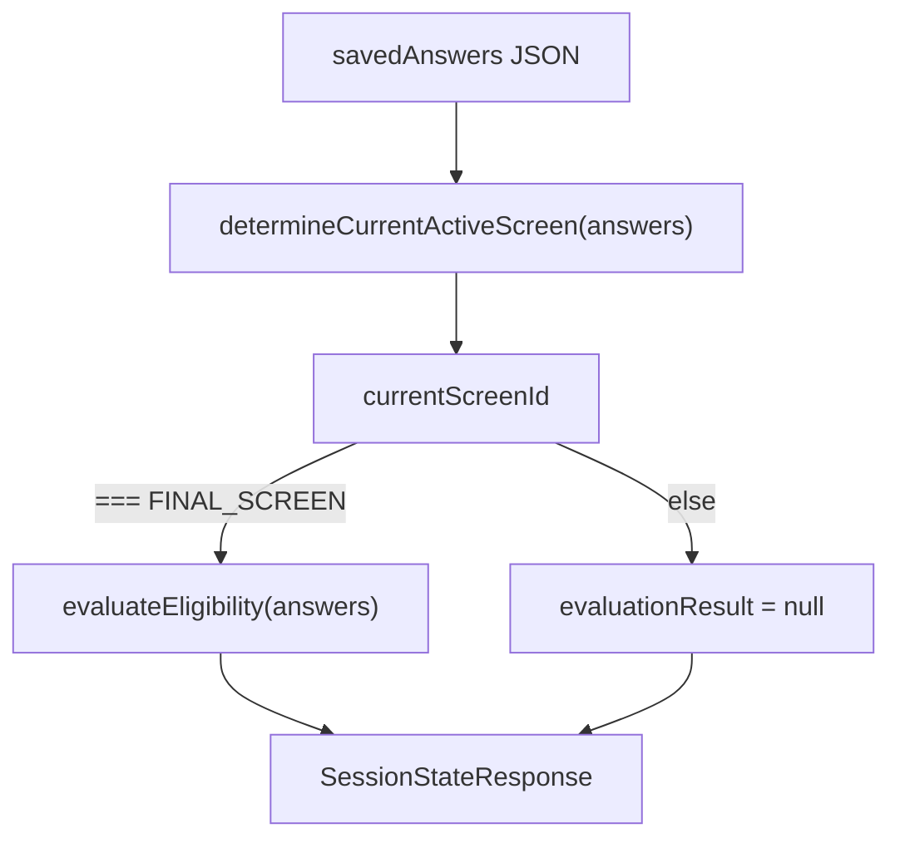
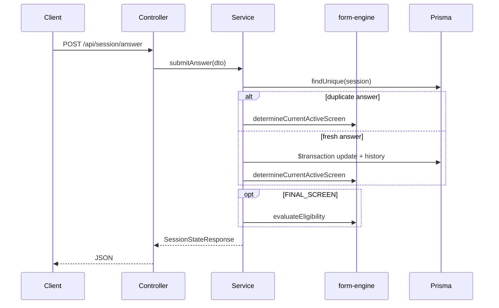

# NestJS Core Session API Implementation

## Response contract (user-confirmed)

Return the **feature-spec** envelope from [contexts/feature-specs/01-nestjs-core-api.md](contexts/feature-specs/01-nestjs-core-api.md), defined locally in the API (do not reuse `SessionStateResponse` from [packages/form-engine/src/types.ts](packages/form-engine/src/types.ts)):

```typescript
interface SessionStateResponse {
  sessionId: string;
  currentScreenId: ScreenId;
  savedAnswers: Partial<FormResponse>; // persisted JSON snapshot
  evaluationResult: EvaluationResult | null; // non-null only when currentScreenId === FINAL_SCREEN
}
```

**Mapping logic** (single private helper in service, e.g. `buildSessionState`):




Imports from `@phoenixlabs/form-engine`: `ScreenId`, `FormResponse`, `EvaluationResult`, `determineCurrentActiveScreen`, `evaluateEligibility` only.

---

## File layout (new under `apps/api/src`)


| Path                                                                                                             | Purpose                                                                                                                                                       |
| ---------------------------------------------------------------------------------------------------------------- | ------------------------------------------------------------------------------------------------------------------------------------------------------------- |
| [apps/api/src/prisma/prisma.service.ts](apps/api/src/prisma/prisma.service.ts)                                   | `extends PrismaClient` from [apps/api/prisma/generated/client.ts](apps/api/prisma/generated/client.ts); `onModuleInit` / `onModuleDestroy` connect/disconnect |
| [apps/api/src/prisma/prisma.module.ts](apps/api/src/prisma/prisma.module.ts)                                     | Global provider/export of `PrismaService`                                                                                                                     |
| [apps/api/src/session/session.module.ts](apps/api/src/session/session.module.ts)                                 | Registers controller + service                                                                                                                                |
| [apps/api/src/session/session.controller.ts](apps/api/src/session/session.controller.ts)                         | `@Controller('api/session')` — `POST start`, `POST answer`, `GET :id`                                                                                         |
| [apps/api/src/session/session.service.ts](apps/api/src/session/session.service.ts)                               | Persistence, dedup, transactions, response assembly                                                                                                           |
| [apps/api/src/session/dto/submit-answer.dto.ts](apps/api/src/session/dto/submit-answer.dto.ts)                   | `sessionId` (UUID), `screenId` (enum), `answer` (validated per screen)                                                                                        |
| [apps/api/src/session/dto/session-state-response.dto.ts](apps/api/src/session/dto/session-state-response.dto.ts) | Feature-spec response type (for typing/docs)                                                                                                                  |
| [apps/api/src/session/pipes/validate-answer.pipe.ts](apps/api/src/session/pipes/validate-answer.pipe.ts)         | Screen-keyed Zod validation (no routing/scoring in API)                                                                                                       |
| [apps/api/src/session/session.controller.spec.ts](apps/api/src/session/session.controller.spec.ts)               | Vitest + `TestingModule`; mocked Prisma                                                                                                                       |
| [apps/api/src/app.module.ts](apps/api/src/app.module.ts)                                                         | Import `PrismaModule`, `SessionModule`                                                                                                                        |
| [apps/api/src/main.ts](apps/api/src/main.ts)                                                                     | Global `ValidationPipe` (`whitelist`, `transform`)                                                                                                            |


---

## Prisma mapping (strict to schema)

[apps/api/prisma/schema.prisma](apps/api/prisma/schema.prisma) models:

- `**Session**`: `id` (UUID), `savedAnswers` (Json, default `{}`), timestamps
- `**SessionHistory**`: `id` (Int autoincrement), `sessionId`, `savedAnswers`, `createdAt`


| Operation                               | Prisma calls                                                                    |
| --------------------------------------- | ------------------------------------------------------------------------------- |
| `POST /api/session/start`               | `session.create({ data: { savedAnswers: {} } })` — UUID from `@default(uuid())` |
| `POST /api/session/answer` (write path) | `$transaction([ session.update(...), sessionHistory.create(...) ])`             |
| `GET /api/session/:id`                  | `session.findUnique({ where: { id } })`                                         |


Cast `savedAnswers` between `Prisma.JsonValue` and `Partial<FormResponse>` at the service boundary only.

---

## Endpoint behavior

### `POST /api/session/start`

1. Create row with `{}`.
2. `currentScreenId = determineCurrentActiveScreen({})` → `ScreenId.AGE`
3. Return `SessionStateResponse` with `evaluationResult: null`.

### `POST /api/session/answer`

1. `findUnique` by `sessionId` → `NotFoundException` if missing.
2. Parse existing `savedAnswers`; **dedup**: if `savedAnswers[screenId]` exists and deep-equals incoming `answer` (`JSON.stringify` comparison is sufficient for JSON-serializable primitives/arrays), **skip** `update` / `sessionHistory.create` / `$transaction`; still run router + return response.
3. Else merge `{ ...savedAnswers, [screenId]: answer }` inside `$transaction` (array form for Prisma 6).
4. Build response via `buildSessionState`.

### `GET /api/session/:id`

1. `ParseUUIDPipe` on `:id`.
2. `findUnique` → `NotFoundException` if missing.
3. Router on stored answers → return same envelope.

No branching/scoring logic in controller/service beyond dedup and persistence.

---

## Answer validation (DTO + pipe)

[submit-answer.dto.ts](apps/api/src/session/dto/submit-answer.dto.ts): `class-validator` for `sessionId` (`@IsUUID()`), `screenId` (`@IsEnum(ScreenId)`), `answer` as `unknown`.

[validate-answer.pipe.ts](apps/api/src/session/pipes/validate-answer.pipe.ts): after DTO class validation, run **Zod** schemas keyed by `screenId`, mirroring [FormResponse](packages/form-engine/src/types.ts) and option literals from [FORM_ENGINE_SCHEMA](packages/form-engine/src/schema.ts) (e.g. radio options, checkbox enums, numeric screens). Reject with `BadRequestException` on failure. **Do not** validate `BMI` or `FINAL_SCREEN` as submit targets (computed/terminal).

Apply pipe on the `answer` endpoint: `@UsePipes(ValidateAnswerPipe)` or method-level combined pipe.

---

## Dependencies and tooling

Update [apps/api/package.json](apps/api/package.json):

- `"@phoenixlabs/form-engine": "*"` (workspace)
- `class-validator`, `class-transformer` (ValidationPipe)
- `vitest` (align with [architecture-overview.md](contexts/architecture-overview.md) and feature spec)
- Change `"test": "vitest run"`; add [apps/api/vitest.config.ts](apps/api/vitest.config.ts) (`environment: 'node'`, `include: ['src/**/*.spec.ts']`, resolve `@phoenixlabs/form-engine`)

Keep existing Jest e2e config untouched unless it conflicts; session tests use Vitest only.

---

## Integration tests ([session.controller.spec.ts](apps/api/src/session/session.controller.spec.ts))

Use `@nestjs/testing` `TestingModule` with `SessionController` + `SessionService` + mocked `PrismaService`:

```typescript
const prisma = {
  session: { create: vi.fn(), findUnique: vi.fn(), update: vi.fn() },
  sessionHistory: { create: vi.fn() },
  $transaction: vi.fn(),
};
```


| Test                      | Assertion                                                                                                                |
| ------------------------- | ------------------------------------------------------------------------------------------------------------------------ |
| `POST start`              | `prisma.session.create` called once; response has UUID `sessionId`, `currentScreenId === AGE`                            |
| `POST answer` duplicate   | Pre-seed `findUnique` with matching `savedAnswers[screenId]`; expect `$transaction` **not** called; response still valid |
| `POST answer` new/changed | Expect `$transaction` called; `session.update` + `sessionHistory.create` invoked                                         |
| `GET :id` invalid         | `NotFoundException` / 404 for unknown UUID                                                                               |


Spy `SessionService` only if testing controller wiring in isolation; prefer full controller+service with mocked Prisma to match spec intent.

---

## Wiring diagram




---

## Progress tracker

After implementation, update [contexts/progress-tracker.md](contexts/progress-tracker.md): mark NestJS API layer complete; move Vitest API tests under Completed; set Next Up to Next.js client integration.

---

## Verification checklist

- `npm run test` in `apps/api` — Vitest passes with zero DB connection
- Manual smoke (optional): `POST start` → `POST answer` → `GET :id` returns consistent envelope
- Dedup path produces identical `currentScreenId` without `$transaction`
- Fresh answer writes both `Session` and `SessionHistory` in one transaction

