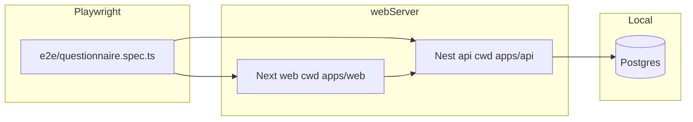

# Playwright E2E execution roadmap

## Preconditions (read order per [AGENTS.md](AGENTS.md))

1. Re-read [contexts/project-overview.md](contexts/project-overview.md) and [contexts/code-standards.md](contexts/code-standards.md) before wiring CI or changing validation contracts.
2. **Database:** Feature spec requires a live local test DB. The API `webServer` child process must receive `DATABASE_URL` (and Prisma must be generated). Easiest path: reuse `[.env.sample](.env.sample)` values and ensure Docker Postgres is up before `npx playwright test`.
3. **Ports / CORS:** Web already defaults API to `http://localhost:3001` in dev ([apps/web/src/lib/api-config.ts](apps/web/src/lib/api-config.ts)). API must run with `PORT=3001` and `CORS_ORIGIN=http://localhost:3000` ([apps/api/src/main.ts](apps/api/src/main.ts)). Nest already exposes `GET /` on the root controller returning 200 — suitable as the Playwright **ready** URL for the API.

## Execution flow (high level)




## Step 1 — Root Playwright package wiring

- Add `@playwright/test` to the **root** [package.json](package.json) `devDependencies` and a script such as `"test:e2e": "playwright test"`.
- Add root [playwright.config.ts](playwright.config.ts) (new file) with:
  - `testDir: 'e2e'`
  - `use.baseURL: 'http://localhost:3000'`
  - `projects` for **Chromium, Firefox, WebKit** (`[devices` from `@playwright/test](https://playwright.dev/docs/test-projects)`)
  - `webServer` **array** (API first, then web), each with:
    - `cwd` set to the workspace package directory so Nest/Next pick up local `.env` files (`apps/api`, `apps/web`)
    - `command`: `npm run start:dev` (api) and `npm run dev` (web) — package scripts from [apps/api/package.json](apps/api/package.json) and [apps/web/package.json](apps/web/package.json)
    - `url`: `http://localhost:3001` and `http://localhost:3000` respectively
    - `reuseExistingServer: !process.env.CI`
    - `timeout` ~120s (Nest compile + Next Turbopack cold start)
    - `env` overrides: API `{ PORT: '3001', CORS_ORIGIN: 'http://localhost:3000' }`; web `{ NEXT_PUBLIC_API_URL: 'http://localhost:3001' }` (plus pass through `DATABASE_URL` for the API child from `process.env`)

## Step 2 — UI hooks required by the spec (minimal, test-oriented)

These are **not** optional if tests must assert `status-eligible`, `status-ineligible`, and `validation-error` as written in [contexts/feature-specs/03-playwright-e2e.md](contexts/feature-specs/03-playwright-e2e.md):


| Requirement                                            | Current gap                                                                                                                                                         | Planned change                                                                                                                                                                                                                                                                                                                                                                                                             |     |
| ------------------------------------------------------ | ------------------------------------------------------------------------------------------------------------------------------------------------------------------- | -------------------------------------------------------------------------------------------------------------------------------------------------------------------------------------------------------------------------------------------------------------------------------------------------------------------------------------------------------------------------------------------------------------------------- | --- |
| `data-testid="status-eligible"` / `status-ineligible"` | [EvaluationDashboard.tsx](apps/web/src/components/form/EvaluationDashboard.tsx) only has `evaluation-dashboard`                                                     | Add outcome-specific `data-testid` on the same card (e.g. `status-eligible` when `result.outcome === 'Eligible'`, `status-ineligible` when `Ineligible`; optional `status-requires-review` for the third outcome for symmetry).                                                                                                                                                                                            |     |
| `data-testid="validation-error"`                       | Errors render as `role="alert"` only ([QuestionRenderer.tsx](apps/web/src/components/form/QuestionRenderer.tsx), [Input.tsx](packages/ui/src/components/Input.tsx)) | Add a single visible container with `data-testid="validation-error"` whenever there is a blocking message (wizard-level `validationError` and/or `Input` `error` prop). Prefer one consistent pattern: wrapper around the alert text in `QuestionRenderer` for radio/checkbox, and extend `Input` error `<p>` with the same testid when `error` is set.                                                                    |     |
| BP conflict (Normal + Hypertensive Crisis)             | No client rule; API accepts any valid subset                                                                                                                        | Implement **documented** behavior in the wizard: when `activeScreenId === BLOOD_PRESSURE_CATEGORIES`, if selection contains incompatible pairs (at minimum **Normal** together with **Hypertensive Crisis**, or broader rule **Normal + any other category** if you want stricter clinical UX), set `validationError` and **block** `goToNextStep` without calling the API. Clear the error when the conflict is resolved. |     |


Expose a small setter from [FormWizardContext.tsx](apps/web/src/context/FormWizardContext.tsx) (e.g. `setValidationError` / `clearValidationError`) so `QuestionRenderer` can flag conflicts immediately on checkbox changes, and mirror the same check inside `goToNextStep` before `submitAnswer`.

## Step 3 — `e2e/questionnaire.spec.ts` (four blocks, testid-only)

**Locator policy:** Use `page.getByTestId(...)` only — no `getByText`. Rely on:

- Landing: `start-session`
- Navigation: `wizard-next`, `wizard-back`, `step-indicator`
- Loading: `wizard-skeleton` ([WizardSkeleton.tsx](apps/web/src/components/form/WizardSkeleton.tsx))
- Number fields: `question-${ScreenId}` ([QuestionRenderer.tsx](apps/web/src/components/form/QuestionRenderer.tsx)) — values match enum strings (`AGE`, `WEIGHT`, …).
- Radio/checkbox native defaults from `@phoenixlabs/ui`: `radio-${value}`, `checkbox-${value}` ([RadioGroup.tsx](packages/ui/src/components/RadioGroup.tsx), [CheckboxGroup.tsx](packages/ui/src/components/CheckboxGroup.tsx)) — full option strings for BP (including parentheses) are valid Playwright test id strings.

**Screen indexing:** [screen-meta.ts](apps/web/src/lib/screen-meta.ts) defines 14 user-facing steps; the **15th** “screen” in product language is the **terminal evaluation** after the last answer ([ScreenId.FINAL_SCREEN](packages/form-engine/src/types.ts) / `phase === 'terminal'`). Tests should assert the evaluation card, not a 15th question card.

### Block 1 — Happy path (full clearance)

1. `page.goto('/')` → `getByTestId('start-session').click()`.
2. Walk **all** user-facing steps with passing inputs aligned to [evaluator.ts](packages/form-engine/src/evaluator.ts) (example set: Age `35`, Weight `90`, Height `175`, Pregnancy `No`, Comorbidities empty or low count, Diabetes `No` to skip HbA1c, BP only non-conflicting choice e.g. `Normal (< 120/80)` alone, Medications without `GLP-1 receptor agonist`, Smoking `No`, Alcohol `Never`, Activity `Moderate (3-4x/week)`, Diet `Balanced diet` only — tune to guarantee `Eligible`).
3. After the last `wizard-next`, assert `getByTestId('status-eligible')` is visible and wizard controls (`wizard-next`) are gone.

### Block 2 — Mid-flow refresh (state hydration)

1. New session from `/` (clear `localStorage` for the session key in `beforeEach` or dedicated helper — key in [session-types.ts](apps/web/src/lib/session-types.ts): `SESSION_STORAGE_KEY`).
2. Advance until `getByTestId('step-indicator')` text matches `**Question 7 of 14`** (seventh entry in `USER_FACING_SCREENS` = `MOST_RECENT_HbA1c`). **Path:** choose Diabetes `**Yes`** on step 6 so step 7 is HbA1c (numeric). The feature spec phrase “select a distinct response option” is implemented as **entering a distinct numeric value** (e.g. `6.4`) on that screen, matching the live schema.
3. `await page.reload()`.
4. Assert transient `wizard-skeleton`, then `step-indicator` still `Question 7 of 14`, and `getByTestId('question-MOST_RECENT_HbA1c')` has value `6.4`.

### Block 3 — Terminal ineligibility (underage)

1. Start session, on `question-AGE` enter `16`, click `wizard-next`.
2. Assert `getByTestId('status-ineligible')` (and optionally `evaluation-dashboard`) — no further forward navigation through the full wizard.

### Block 4 — BP conflicting multi-select

1. Navigate to `BLOOD_PRESSURE_CATEGORIES` (same happy-path prefix as needed: valid age/BMI/pregnancy/comorbid/diabetes choices).
2. Toggle `**checkbox-Normal (< 120/80)`** and `**checkbox-Hypertensive Crisis (>180/>120)**` both on.
3. Assert `getByTestId('validation-error')` visible (once UI hook exists).
4. `wizard-next` should not advance (assert still on BP question — e.g. `step-indicator` unchanged or BP inputs still present).
5. Uncheck Normal, click `wizard-next`, assert step advances (e.g. step indicator shows medications / next title).

## Step 4 — Documentation / tracker

- After implementation, update [contexts/progress-tracker.md](contexts/progress-tracker.md) Playwright / E2E row under **Completed** or **Next Up** per workspace rule.

---

## Proposed file contents (for review before any disk writes)

### Root [playwright.config.ts](playwright.config.ts) (new)

```typescript
import { defineConfig, devices } from "@playwright/test";

/**
 * API and web inherit DATABASE_URL / secrets from the parent process env when present.
 * Ensure Postgres is reachable before running E2E.
 */
export default defineConfig({
  testDir: "e2e",
  fullyParallel: true,
  forbidOnly: !!process.env.CI,
  retries: process.env.CI ? 2 : 0,
  reporter: [["list"]],
  use: {
    baseURL: "http://localhost:3000",
    trace: "on-first-retry",
  },
  projects: [
    { name: "chromium", use: { ...devices["Desktop Chrome"] } },
    { name: "firefox", use: { ...devices["Desktop Firefox"] } },
    { name: "webkit", use: { ...devices["Desktop Safari"] } },
  ],
  webServer: [
    {
      command: "npm run start:dev",
      cwd: "apps/api",
      url: "http://localhost:3001",
      reuseExistingServer: !process.env.CI,
      timeout: 120_000,
      env: {
        ...process.env,
        PORT: "3001",
        CORS_ORIGIN: "http://localhost:3000",
      },
    },
    {
      command: "npm run dev",
      cwd: "apps/web",
      url: "http://localhost:3000",
      reuseExistingServer: !process.env.CI,
      timeout: 120_000,
      env: {
        ...process.env,
        NEXT_PUBLIC_API_URL: "http://localhost:3001",
      },
    },
  ],
});
```

### Root [e2e/questionnaire.spec.ts](e2e/questionnaire.spec.ts) (new)

```typescript
import { test, expect } from "@playwright/test";

const SESSION_STORAGE_KEY = "phoenixlabs_session_id";

test.beforeEach(async ({ page }) => {
  await page.goto("/");
  await page.evaluate((k) => localStorage.removeItem(k), SESSION_STORAGE_KEY);
  await page.reload();
});

test.describe("Questionnaire E2E", () => {
  test("happy path: full clearance through terminal eligibility", async ({
    page,
  }) => {
    await page.goto("/");
    await page.getByTestId("start-session").click();

    await page.getByTestId("question-AGE").fill("35");
    await page.getByTestId("wizard-next").click();

    await page.getByTestId("question-WEIGHT").fill("90");
    await page.getByTestId("wizard-next").click();

    await page.getByTestId("question-HEIGHT").fill("175");
    await page.getByTestId("wizard-next").click();

    await page.getByTestId("radio-No").click();
    await page.getByTestId("wizard-next").click();

    await page.getByTestId("wizard-next").click();

    await page.getByTestId("radio-No").click();
    await page.getByTestId("wizard-next").click();

    await page.getByTestId("checkbox-Normal (< 120/80)").click();
    await page.getByTestId("wizard-next").click();

    await page.getByTestId("wizard-next").click();

    await page.getByTestId("radio-No").click();
    await page.getByTestId("wizard-next").click();

    await page.getByTestId("radio-Never").click();
    await page.getByTestId("wizard-next").click();

    await page.getByTestId("radio-Moderate (3-4x/week)").click();
    await page.getByTestId("wizard-next").click();

    await page.getByTestId("checkbox-Balanced diet").click();
    await page.getByTestId("wizard-next").click();

    await expect(page.getByTestId("status-eligible")).toBeVisible();
    await expect(page.getByTestId("wizard-next")).toHaveCount(0);
  });

  test("mid-flow refresh: hydrates screen 7 (HbA1c) with restored value", async ({
    page,
  }) => {
    await page.goto("/");
    await page.getByTestId("start-session").click();

    await page.getByTestId("question-AGE").fill("35");
    await page.getByTestId("wizard-next").click();
    await page.getByTestId("question-WEIGHT").fill("90");
    await page.getByTestId("wizard-next").click();
    await page.getByTestId("question-HEIGHT").fill("175");
    await page.getByTestId("wizard-next").click();
    await page.getByTestId("radio-No").click();
    await page.getByTestId("wizard-next").click();
    await page.getByTestId("wizard-next").click();
    await page.getByTestId("radio-Yes").click();
    await page.getByTestId("wizard-next").click();

    await expect(page.getByTestId("step-indicator")).toHaveText(
      /Question 7 of 14/,
    );

    await page.getByTestId("question-MOST_RECENT_HbA1c").fill("6.4");
    await page.reload();

    await expect(page.getByTestId("wizard-skeleton")).toBeVisible();
    await expect(page.getByTestId("wizard-skeleton")).toBeHidden({
      timeout: 30_000,
    });

    await expect(page.getByTestId("step-indicator")).toHaveText(
      /Question 7 of 14/,
    );
    await expect(page.getByTestId("question-MOST_RECENT_HbA1c")).toHaveValue(
      "6.4",
    );
  });

  test("terminal: underage on screen 1 routes to ineligible dashboard", async ({
    page,
  }) => {
    await page.goto("/");
    await page.getByTestId("start-session").click();
    await page.getByTestId("question-AGE").fill("16");
    await page.getByTestId("wizard-next").click();

    await expect(page.getByTestId("status-ineligible")).toBeVisible();
    await expect(page.getByTestId("evaluation-dashboard")).toBeVisible();
  });

  test("blood pressure: conflicting selections block next until resolved", async ({
    page,
  }) => {
    await page.goto("/");
    await page.getByTestId("start-session").click();

    await page.getByTestId("question-AGE").fill("35");
    await page.getByTestId("wizard-next").click();
    await page.getByTestId("question-WEIGHT").fill("90");
    await page.getByTestId("wizard-next").click();
    await page.getByTestId("question-HEIGHT").fill("175");
    await page.getByTestId("wizard-next").click();
    await page.getByTestId("radio-No").click();
    await page.getByTestId("wizard-next").click();
    await page.getByTestId("wizard-next").click();
    await page.getByTestId("radio-No").click();
    await page.getByTestId("wizard-next").click();

    await expect(page.getByTestId("step-indicator")).toHaveText(
      /Question 8 of 14/,
    );

    await page.getByTestId("checkbox-Normal (< 120/80)").click();
    await page.getByTestId("checkbox-Hypertensive Crisis (>180/>120)").click();

    await expect(page.getByTestId("validation-error")).toBeVisible();

    await page.getByTestId("wizard-next").click();
    await expect(page.getByTestId("step-indicator")).toHaveText(
      /Question 8 of 14/,
    );

    await page.getByTestId("checkbox-Normal (< 120/80)").click();
    await page.getByTestId("wizard-next").click();

    await expect(page.getByTestId("step-indicator")).toHaveText(
      /Question 9 of 14/,
    );
    await expect(page.getByTestId("validation-error")).toHaveCount(0);
  });
});
```

**Note:** The happy-path and BP tests assume the **comorbidities** step allows advancing with **no** checkbox selected (empty array). If UX later requires at least one selection, adjust that step to click a single comorbidity and revisit evaluator thresholds (comorbidity count vs “Requires Clinical Review”).

### Package.json delta (root)

Add to `devDependencies`: `"@playwright/test": "^1.52.0"` (pin to whatever the repo standardizes). Add script: `"test:e2e": "playwright test"`.

### Application files to touch (summary)

- [apps/web/src/components/form/EvaluationDashboard.tsx](apps/web/src/components/form/EvaluationDashboard.tsx) — outcome testids.
- [apps/web/src/components/form/QuestionRenderer.tsx](apps/web/src/components/form/QuestionRenderer.tsx) — `validation-error` wrapper; BP checkbox `onChange` conflict handling with context setter.
- [apps/web/src/context/FormWizardContext.tsx](apps/web/src/context/FormWizardContext.tsx) — BP guard in `goToNextStep`; expose validation setter.
- Optionally [packages/ui/src/components/Input.tsx](packages/ui/src/components/Input.tsx) — add `data-testid="validation-error"` on the error line when `error` is truthy (keeps number-field failures on-spec too).

---

## Verification

- From repo root: `npx playwright install` (first time) then `npx playwright test` — both servers should start; all **four** tests **green** on **three** browsers.
- Confirm zero `getByText` / visible-string locators in `e2e/`.

